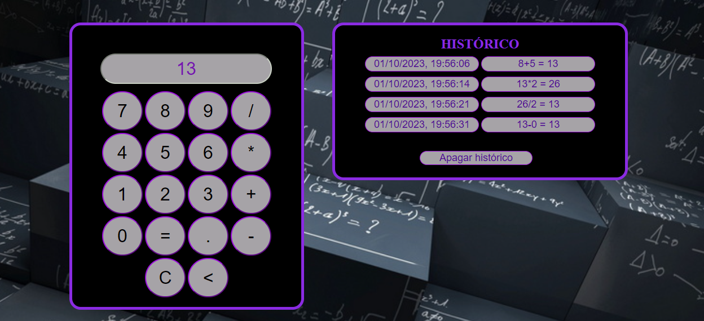

# CALCULADORA JS
---
> Projeto usando JS / HTML / CSS !

   PROJETO PROPOSTO PELA STACKX, QUE SUGERE A CRIAÇÃO DE UMA CALCULADORA COM FUNÇÕES BÁSICAS.

   

        
   

   
   

   ###### Técnicas aplicadas:

   - Tags semânticas.
   - Primeira versão do projeto.

   ###### META:

   Jorge Augusto - [linkedin](https://www.linkedin.com/in/jorgeaugusto88/)

   